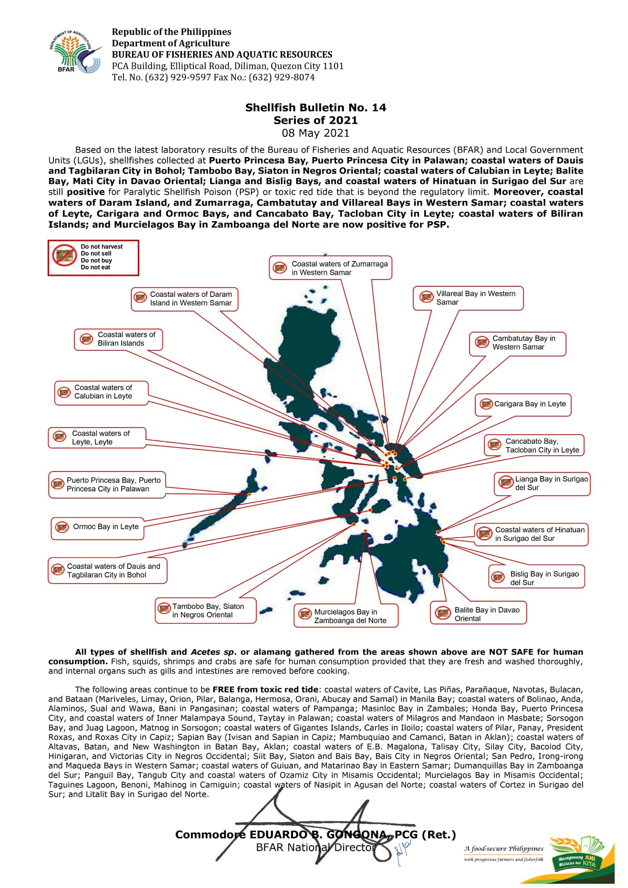
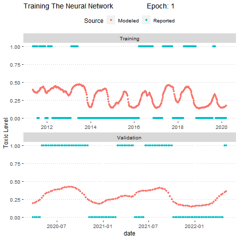
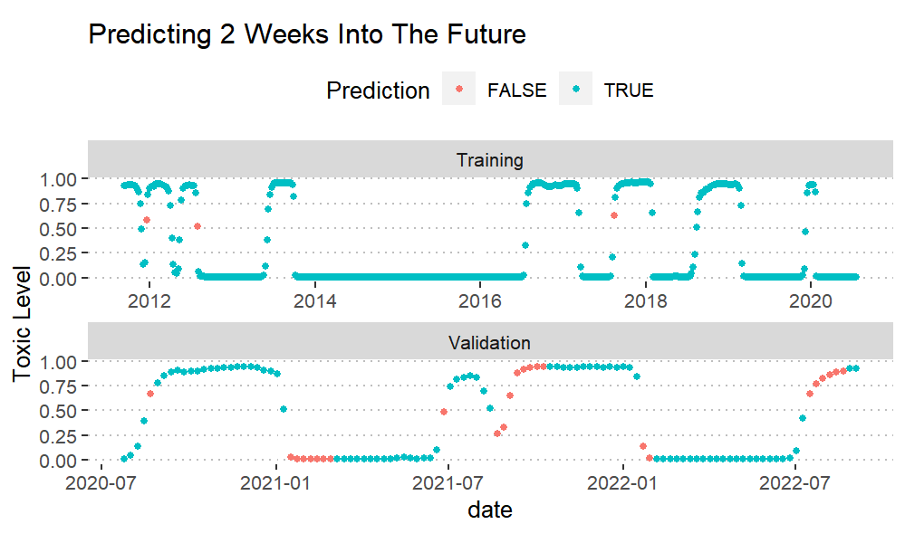
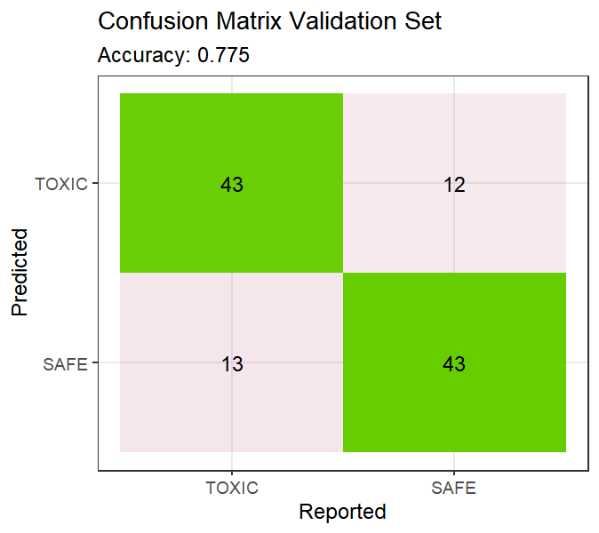
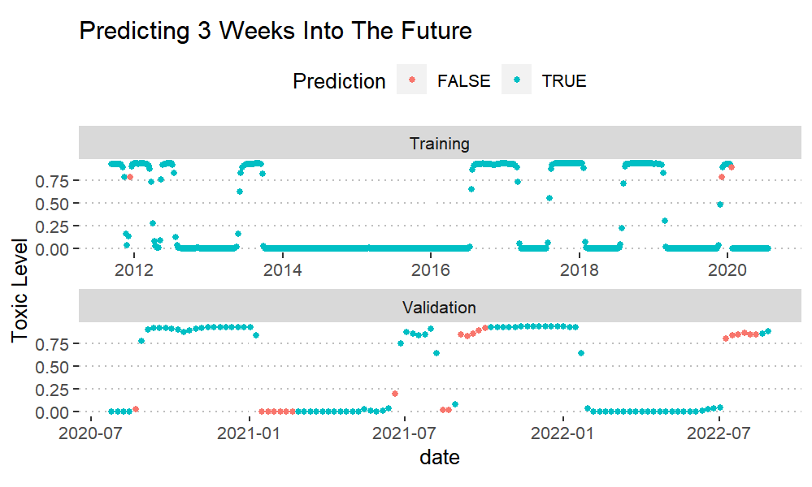
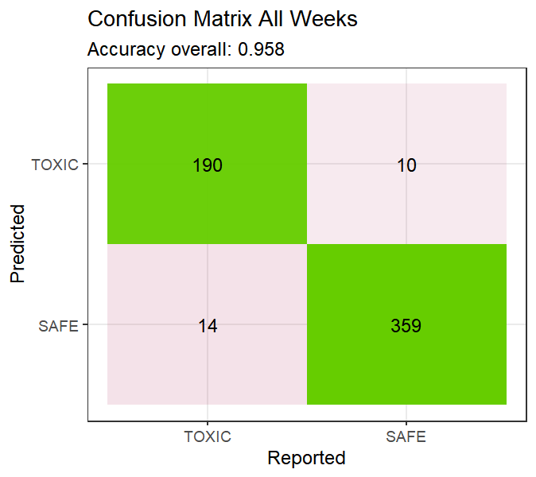
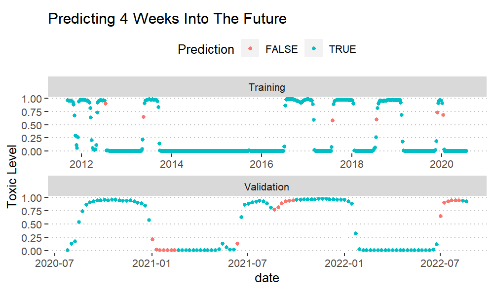
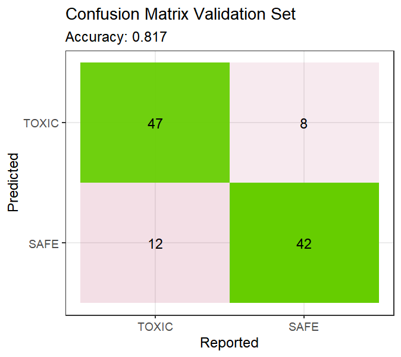

```{r include=FALSE}
library(ggplot2)
library(lubridate)
library(ggpubr)

```


(this is a technical report that is a wip and hopfully a future published paper)


## Introduction:

  Red Tide is a general term for marine events that result from the rapid reproduction of algae that change the color of the ocean surface. Sometimes these events are referred to as harmful algal blooms (HABs) when they coincide with the degradation of the environment such as the release of toxins. One impact that HABs have on the environment is the accumulation of toxins in the tissues of molluscs. These toxins do not have a significant effect on the mollusc themselfs, but when accumulated in a high enough concentration and ingested by humans, can result in paralytic shellfish poisoning (PSP), and can even cause death (Grattan et al). 

  The Philippines is one country that suffers from the Health and economic consequences of HABs. The Filipino Bureau of Fisheries and Aquatics Resources (BFAR) reports that within the interval between 1983 and 2002 there were 2122 cases of PSP and 117 deaths (Bajarias et al), ranking the Philippines above all other Asian countries (Azanza and Taylor) . During particularly bad outbreak years, the economic effects can result in millions of pesos in economic losses, disruption of international trading as import bans are imposed and the displacement of thousands of artisan fishers (Bajarias et al). 

  The first recorded case of PSP in the Philippines coincided with visual reports of red tides in the year of 1983 (Estudillo). Since then, PSP and red tides have proliferated throughout the archipelago (Bajarias et al) and the Filipino government has taken measures to limit losses caused by red tides. A national red tide task force was created and implemented a monitoring program that utilizes site sampling and bioassays to determine toxicity. Due to budgeting constraints the frequency and duration of the monitoring surveys vary between sites (Bajarias et al). Reports from this red tide monitoring program was used in this study as the response variable for this forecast

 
Example of report:
<center>
{ width=40% }  
</center>
 
An artificial neural network (ANN) is used in this study to predict the toxicity status of different sites in the Philippines. ANNs have shown promising results in forecasting HABs and shellfish contamination and were chosen due to their ability to extract nonlinear relationships in data.

## Methods:

### Cleaning Responce Variable


The labels for this model, and therefore the focus of the predictive model, are the Red Tide bulletins published by BFAR. These reports are released at an irregular interval, typically about 2 weeks apart and state the status of green muscle toxicity for many sites across the philippines. Toxicity is reported as a binary toxic or not toxic status, so therefore the model’s output will too be binary. 
	
These reports are archived on facebook up until 2012, and a information request was submitted to the Filipino buro of information and the status of red tides was provided up until the inception of the red tide program in 2002. These reports provide over 20 years of a very coarse timeline of the status of a very limited number of sites in the Philippines. About 8 sites have been tested regularly since the program's inception.
  
###	Data collection:
A seemingly novel aspect of this project was the use of Google Earth Engine (GEE) for the entirety of data collection. GEE is a free online database with thousands of terabytes of spatial and temporal data that is hosted and accessed through Google's own computing power. This data can be quarried and downloaded through javascript commands through GEE’s API. 

A number of different datasets were used. These include temperature, salinity, water velocity, and water height from the Hybrid Coordinate Ocean Model. Percent cloud coverage from the NCEP-DOE Reanalysis 2 project database. Precipitation from the Global Precipitation Measurement mission. 

Every one of these datasets are extrapolated through space and time and are subject to considerable error. Data was organized into weekly blocks and the mean value for all variables were collected at various locations and associated with the site of reported toxins. This data was paired with the toxin labels and organized into time series for training. 

### Training:

A long term short term (LSTM) sequential neural network was used because of the importance that sequence has in the input data due to it being a time series. The LSTM structure is a variant of the recurrent neural network (RNN) structure and allows for states to be carried from one time feature to the next. In our case that would be one week to the following week. The data was loaded forward facing, meaning that the oldest weeks were the first to be inputted into the model while the most recent weeks were the last. This was done under the assumption that the most recent environmental conditions have the most weight on the status of toxicity. . 


<center>
{ width=60% }  
</center>


## RESULTS


Surprisingly, out of the three models below, the one with the least amount of lag between the prediction interval (two weeks) is the worst. The best preforming model is the one that predicts four weeks into the future. 

The three plots shows the performance of the model on the entire data set with distinctions being made between the training and validation sets. The model has never seen the validation set and therefore should be have a higher weight when evaluating performance. 

<center>
{ width=75% }
</center>


<center>
{ width=39% } { width=39% }
</center>


## -


<center>
{ width=75% }
</center>


<center>
{ width=39% } { width=39% }
</center>


## -


<center>
{ width=75% }
</center>


<center>
{ width=39% } { width=39% }
</center>


## Bibliography


Andres, John Kristoffer, Aletta T. Yñiguez, Jennifer Mary Maister, Andrew D. Turner, Dave Eldon B. Olano, Jenelyn Mendoza, Lilibeth Salvador-Reyes, and Rhodora V. Azanza. 2019. “Paralytic Shellfish Toxin Uptake, Assimilation, Depuration, and Transformation in the Southeast Asian Green-Lipped Mussel (Perna Viridis).” Toxins 11 (8): 468. https://doi.org/10.3390/toxins11080468.


Azanza, R. V., and F. J. Taylor. 2001. “Are Pyrodinium Blooms in the Southeast Asian Region Recurring and Spreading? A View at the End of the Millennium.” Ambio 30 (6): 356–64.


Bajarias, Fe Farida A, Masaaki Kodama, and Setsuko Sakamoto. n.d. “In the Philippines: Option.”


Cho, Hyungmin, U-Jin Choi, and Heekyung Park. 2018. “DEEP LEARNING APPLICATION TO TIME-SERIES PREDICTION OF DAILY CHLOROPHYLL-A CONCENTRATION.” In , 157–63. Naples, Italy. https://doi.org/10.2495/EID180141.


Chollet, François, and Joseph J. Allaire. 2018. Deep Learning with R. Shelter Island, NY: Manning Publications Co.


Cruz, Rafaela C., Pedro Reis Costa, Susana Vinga, Ludwig Krippahl, and Marta B. Lopes. 2021. “A Review of Recent Machine Learning Advances for Forecasting Harmful Algal Blooms and Shellfish Contamination.” Journal of Marine Science and Engineering 9 (3): 283. https://doi.org/10.3390/jmse9030283.


Gacutan, R. Q., M. Y. Tabbu, E. J. Aujero, and F. Icatlo. 1985. “Paralytic Shellfish Poisoning Due to Pyrodinium Bahamense Var. Compressa in Mati, Davao Oriental, Philippines.” Marine Biology 87 (3): 223–27. https://doi.org/10.1007/BF00397798.


Grattan, Lynn M., Sailor Holobaugh, and J. Glenn Morris. 2016. “Harmful Algal Blooms and Public Health.” Harmful Algae, Harmful Algal Blooms and Public Health, 57 (July): 2–8. https://doi.org/10.1016/j.hal.2016.05.003.


Montojo, Ulysses M., Setsuko Sakamoto, Mirriam F. Cayme, Norvida C. Gatdula, Elsa F. Furio, Juan R. Relox, Shigeru Sato, Yasuwo Fukuyo, and Masaaki Kodama. 2006. “Remarkable Difference in Accumulation of Paralytic Shellfish Poisoning Toxins among Bivalve Species Exposed to Pyrodinium Bahamense Var. Compressum Bloom in Masinloc Bay, Philippines.” Toxicon 48 (1): 85–92. https://doi.org/10.1016/j.toxicon.2006.04.014.


