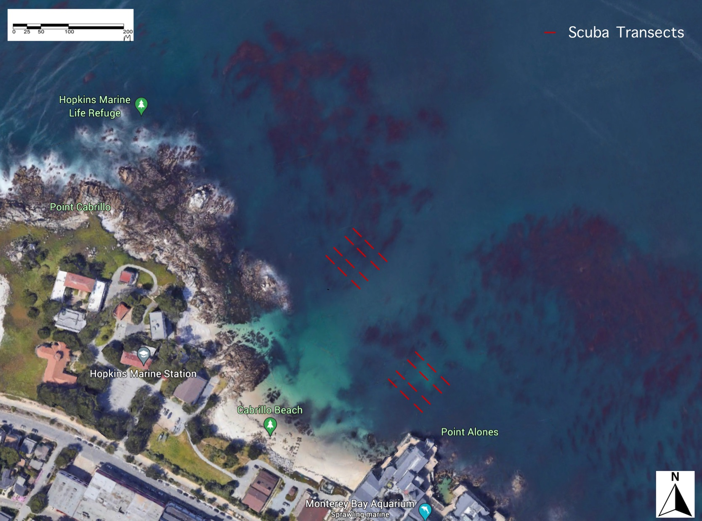
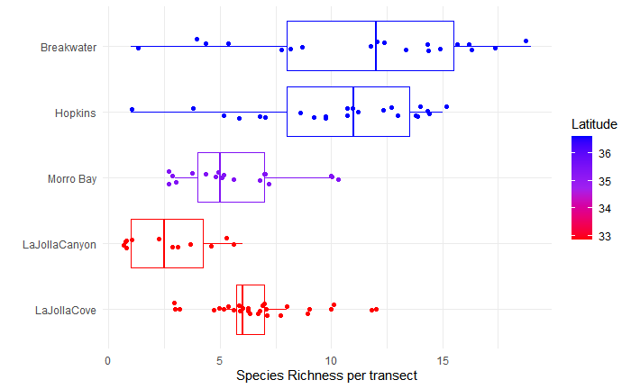

{ width=70% }  

This was a highly collaborative project in the sixth year of this project’s monitoring efforts to characterize the biogeography of the subtidal region of one of the world’s most biologically active coastlines through the implementation of Underwater Video Capture (UVC). Fish, invertebrates, and algae were sampled with video recordings at four locations along the California coast.
 
The specific objectives of this long-term project is to survey distinct biogeographical zones along California’s coast, both inside and outside of Marine Protected Areas, including: Hopkins State Marine Reserve, San Carlos Beach, Morro Bay, La Jolla Cove, and La Jolla Canyon. And apply statistical techniques to describe the differences

{ width=90% }  

This plot shows one of the many statistical analysis ran on the data collected and shows the difference in species richness from the different sites
