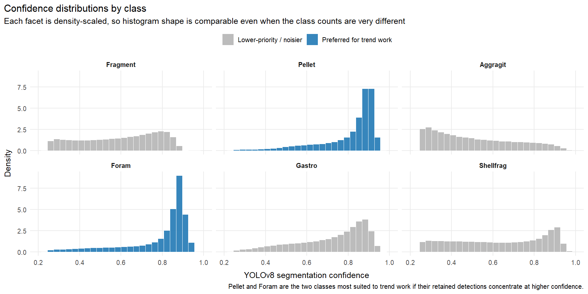
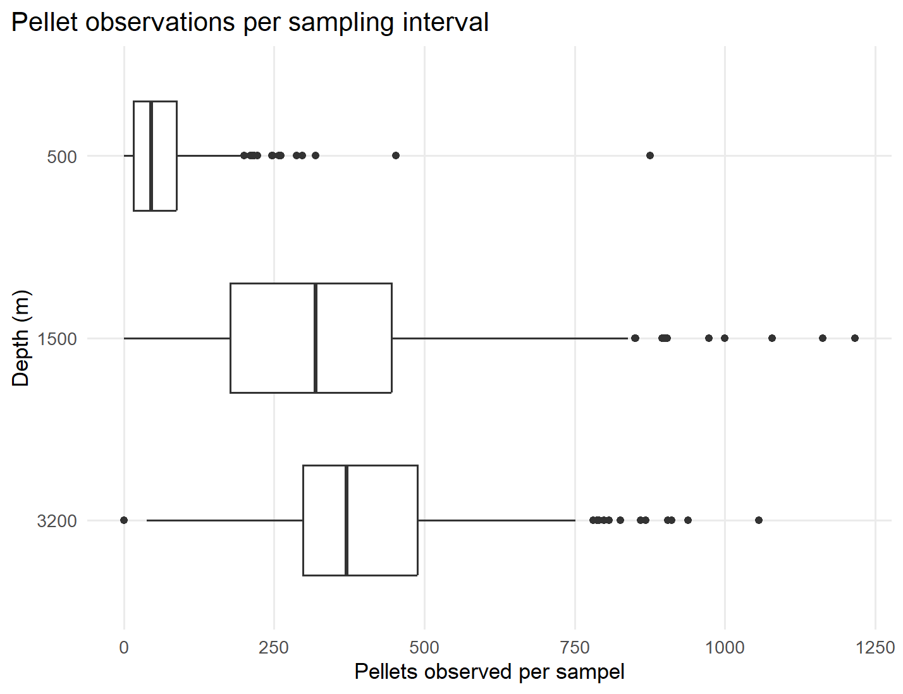
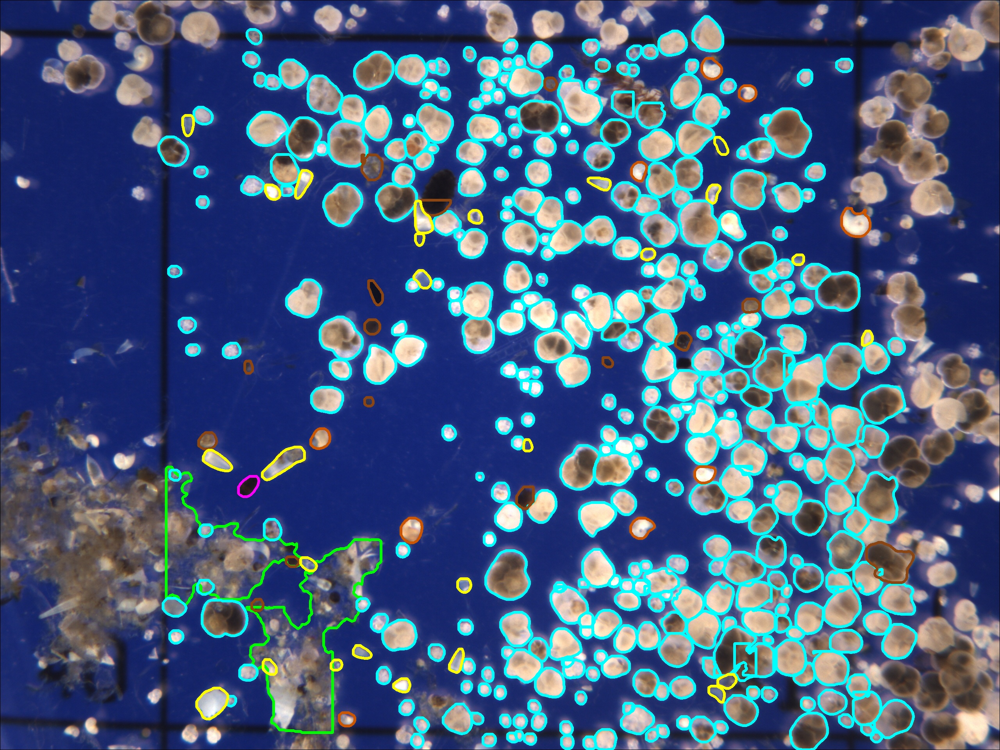
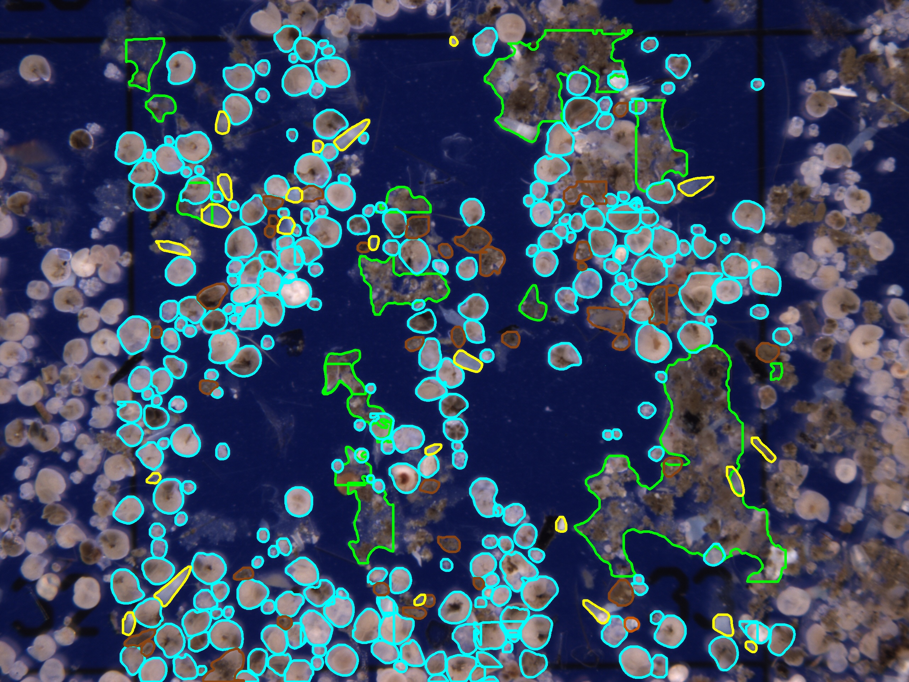
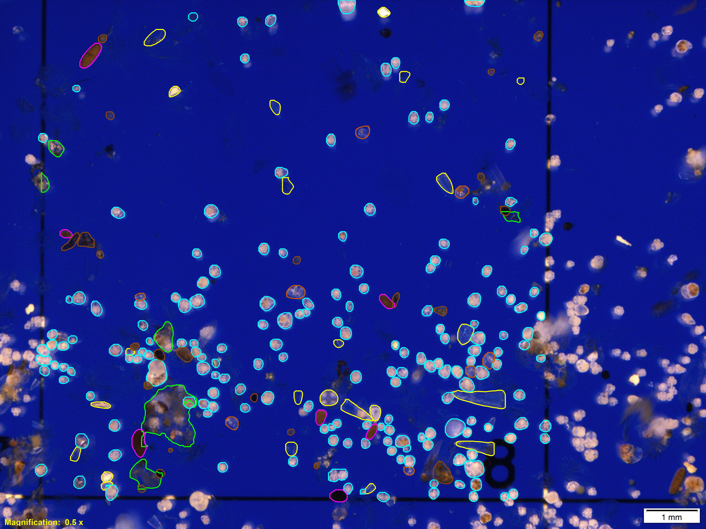
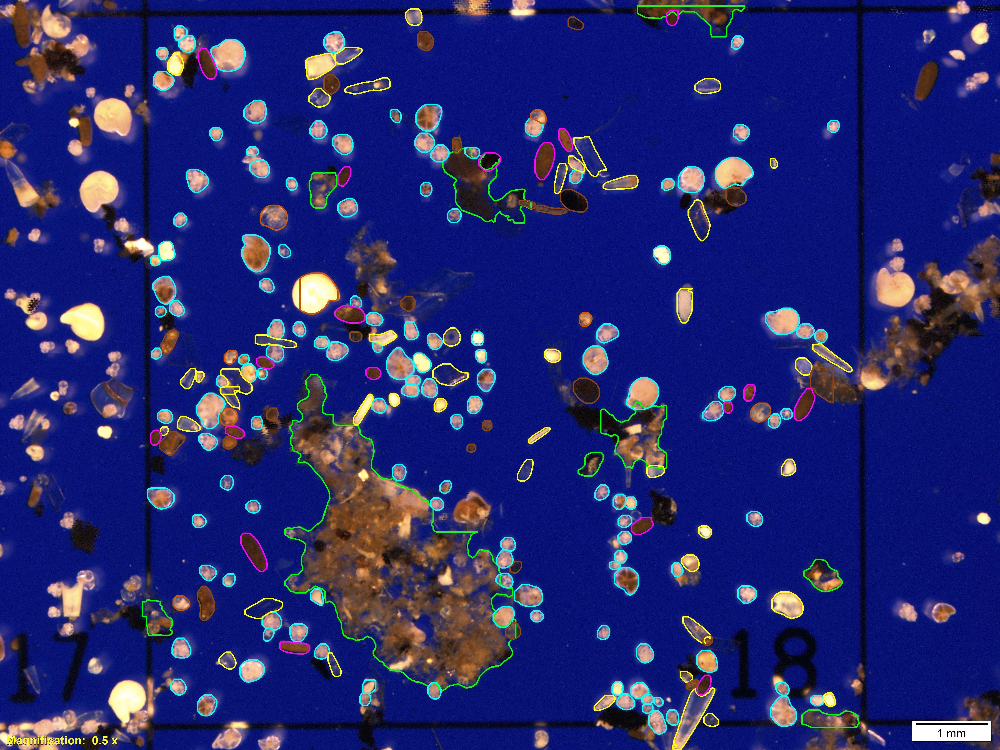

Every day a slow rain of particles falls through the ocean. Produced in the sunlit surface layer by phytoplankton blooms, zooplankton grazing, and the scavenging of mineral dust, this sinking material carries carbon, nutrients, and trace elements from the surface into the deep ocean. That transfer is the heart of the "biological pump," the set of processes that moves carbon out of contact with the atmosphere and into the ocean interior, where it can remain sequestered for centuries or longer.

The [Oceanic Flux Program](https://www.mbl.edu/research/research-centers/ecosystems-center/research-projects/oceanic-flux-program-ofp) (OFP) has been measuring this particle rain longer than any program in the world. Since 1978, a mooring anchored in 4,500 meters of water some 75 kilometers southeast of Bermuda has carried three sediment traps at 500, 1,500, and 3,200 meters depth, each collecting the sinking flux at roughly two-week resolution. The OFP record provided the first direct evidence that the deep ocean is seasonal: the amount and composition of material reaching the abyss pulses in step with the annual cycle of phytoplankton production in the surface waters overhead.

A large part of the program's value lies in *what* the particles are. After each mooring recovery, the samples are size-fractionated and the larger fractions are photographed under a stereo microscope, producing image catalogs of the individual components of the flux: fecal pellets, foraminifera, shell fragments, aggregates, and more. These photoscans are the raw material for "virtual analysis," the quantification of flux composition one particle at a time. But sorting and counting particles by eye is slow, subjective, and hard to scale across the decades of samples the program has collected.

This project automates that step. A [YOLOv8](https://docs.ultralytics.com/) instance-segmentation model was trained to detect and classify every particle in the microscope images into six morphotypes:

- **Fragment**: broken skeletal or organic debris
- **Pellet**: fecal pellets
- **Aggregate**: amorphous aggregates of organic matter
- **Foram**: foraminifera (calcareous tests)
- **Gastro**: gastropod (pteropod) shells
- **Shellfrag**: shell fragments

## Framework

The pipeline turns a raw microscope image into a set of classified particles ready for quantitative analysis, in four stages:

1. **Imaging.** Size-fractionated samples from the three trap depths are photographed under standardized illumination, producing high-resolution scans of the particles.
2. **Segmentation.** YOLOv8 detects each particle, draws a pixel-level mask around it, and assigns it one of the six classes.
3. **Confidence filtering.** Every detection carries a confidence score. Detections below a threshold are dropped, so that only reliable classifications feed into the counts.
4. **Counting.** The retained detections are tallied per sample and per depth, converting raw images into the time series that underpin the flux analyses.

The advantage of segmentation over simple bounding boxes is that it measures each particle as a region rather than a point, which matters for a program whose questions ultimately concern the *mass* and *composition* of the sinking material, not just its abundance.

## Results

On the validation set the model reached a mask mAP50 of roughly 0.55, meaning it localizes and classifies the particles reasonably well. The more important question for a monitoring program, however, is *which* classes can be trusted for long-term trend work, and what they reveal about the flux.

### Confidence by class

Not all classes are equally reliable. The distribution of confidence scores shows which detections the model is certain about and which it is not:

{ width=80% }

###### Confidence distributions for each of the six particle classes. Pellet and Foram (blue) concentrate at high confidence, while the other four classes (grey) are noisier.

**Pellet** and **Foram** detections are strongly right-skewed, clustering near a confidence of 0.9 or higher. The model is confident when it sees them, which makes these two classes the most suitable for building time series. The remaining classes, **Fragment**, **Aggregate**, **Gastro**, and **Shellfrag**, show broader or flatter distributions, indicating noisier detections that should be treated as lower priority for trend work.

### Pellet flux by depth

Fecal pellets are one of the fastest and most efficient vectors for carbon export: zooplankton package fine material into dense pellets that sink rapidly, bypassing much of the remineralization that would otherwise recycle the carbon in the upper ocean. Tracking pellet abundance through the water column is therefore a direct window on export efficiency.

{ width=75% }

###### Pellet observations per sampling interval at 500, 1,500, and 3,200 meters. Medians rise with depth, and each depth shows a long right tail of high-flux outliers.

The boxplots show a clear depth pattern. The 500 meter trap records a median of only a few tens of pellets per sampling interval, while the 1,500 and 3,200 meter traps record medians of a few hundred. Equally striking is the long right tail at every depth: occasional sampling intervals contain many hundreds, sometimes more than a thousand, pellets, the signature of the episodic, high-flux events that punctuate the OFP record.

### Classifying real samples

The figures below show the model applied to actual microscope images from the OFP archive. Each particle is outlined with a colored mask according to its predicted class.

{ width=49% }  { width=49% }

###### Left: 500 meter trap sample, March 2009. Right: 500 meter trap sample, April 2013.

{ width=49% }  { width=49% }

###### Left: 1,500 meter trap sample, April 2019. Right: 1,500 meter trap sample, August 2020.

## Outlook

The immediate result of this work is a classifier that can process the OFP's growing library of particle images automatically, replacing slow manual counts with reproducible, per-particle measurements. Because **Pellet** and **Foram** are both abundant in the flux and reliably detected, they offer the most promising route to a multi-decadal, image-derived time series of flux composition.

That time series matters. The OFP's central scientific questions, how much carbon reaches the deep ocean, how seasonally and interannually it varies, and how it responds to basin-scale forcing such as the North Atlantic Oscillation, depend on exactly the kind of long, continuous, particle-level records this pipeline is designed to produce. With automated classification in hand, the decades of photoscans the program has accumulated can be mined as data rather than simply archived as images.
