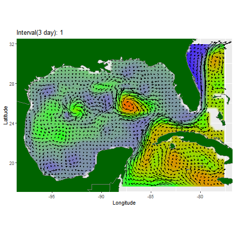

{ width=49% } { width=49% }

I have been messing with HYCOM's water velocity data and trying to come up with a way to visualize water movement in order to look for signs of upwelling. I settled on this format that shows the water velocity as vector arrows and the water elevation as a raster. Currently I have a script that can make this animation at any location at any time. 

If you would like this animation at a specific time and place, send me an email. Or, you can easily gather the data needed to make a similar plot using [this package](https://github.com/JaceInnis/RGEEtools) that I have created. 

