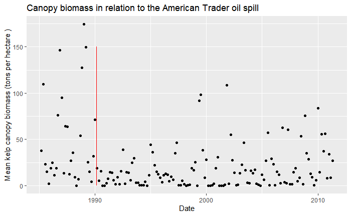

 

{ width=48% }    { width=48% }  

###### Red line represents the the American Trader oil spill event

Given kelp biomass extrapolated from canopy coverage obtained from landsat images, I conducted an exploratory data analysis to look for an effect caused by the 1990 American Trader oil spill. I found a significant reduction in the average kelp biomass around the oil spill, and quantified the recovery rate. From a two sample T test of before and after the spill I found a significant difference. 

