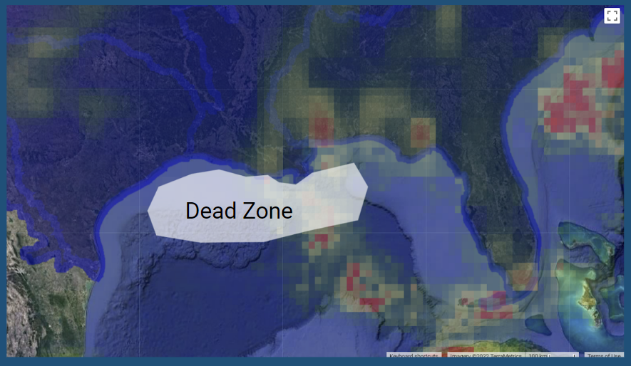

 

{ width=40% }  { width=40% }  

In this project, I used NASA’s rainfall dataset in conjunction with a mask created by USGA’s drainage basin shape file in order to assess the correlation between the Louisiana dead zone size and yearly precipitation in the basin. The Mississippi drainage basin covers a large portion of the continental US and includes a lot of agriculture. Our question was is the amount of rainfall leading up to the dead zone correlated to it's size?

{ width=70% } 

While this plot dose show a slightly positive trend, it is not significant. Meaning that the size of the dead zone is likely **not** connected with rainfall, but other physical factors. 
