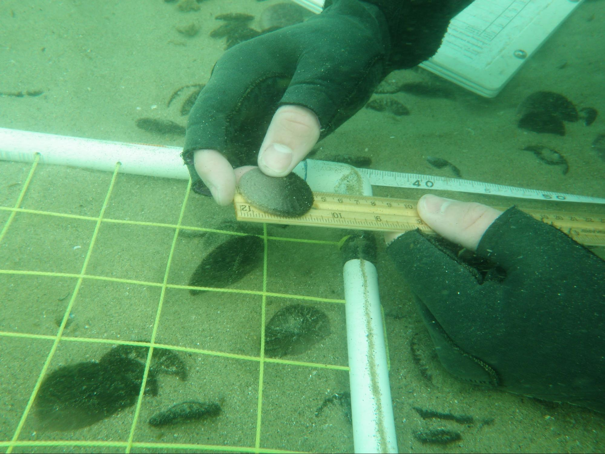

{ width=49% }  { width=40% }  

For my final scientific dive project, in a group of two, we tested the observation that sand dollars tend to be larger the further from the shore. This is known to be true in Oregon and Washington, and after our 6 dive data collection and analysis, we found it to be true in the Monterey Bay. 

$Size = \beta_1*Distance + Error$

p-value: 2.71e-15   
R-squared:  0.3175

