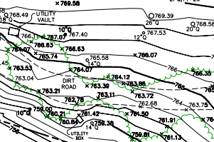

 

{ width=100% height=800px}  

This map was made using AutoCAD with data that I collected using a total station in the field. The entire survey took about three days and includes the property boundary, all trees greater than 6 inches in diameter, the drip line of the tree canopy, elevation, roads and utilities. The elevation was referenced to a single point utilizing the NAV datum of 1988.

The drafting took about the same amount of time and was one of my first big projects. I think being able to draft maps like this for construction has allowed me get an intuitive understanding of what should and shouldn't be shown on maps depending on the purpose that it is being used for.

This map is intended to be used by an architect to design a building to be placed on the property so accuracy is very important.

This property is located in a private community calling itself the Santa Lucia Preserve because they claim to be protecting and managing 90% of its land for wildlife stustainablitlity. It is a very pretty location in the hills east of Monterey covered in big oaks.

{ width=30% }  { width=30% }  

