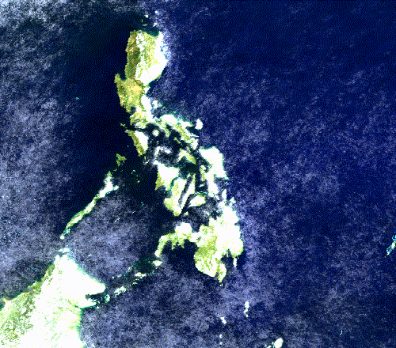
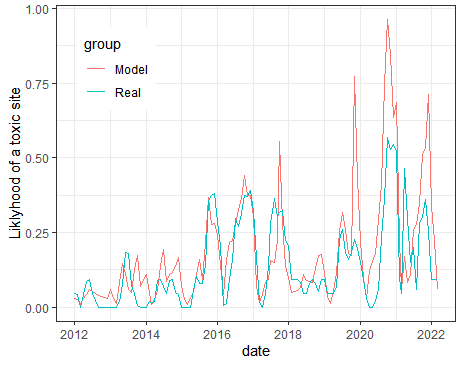

{ width=40% } { width=40% }
{ width=40% } { width=40% }

Over the course of a year, I used various methods in order to see what environmental variables are important in the prediction of shellfish toxicity in the Philippines. I digitized over a decade of  [HAB reports](http://bfar-frmdhabmonitoring.com.ph/shellfishBulletins/102) from BFAR, a [government agency in the philippines](https://www.bfar.da.gov.ph/). Using this data, which reports the presence of toxic sites, I utilized Java to access data from Google Earth Engine [(GEE)](https://earthengine.google.com/), a geospatial data management system.

### Independent research project

{ width=60% }  

For my independent research, I used a novel AI algorithm to predict site toxicity. I trained and tested an artificial neural network using [TensorFlow](https://www.tensorflow.org/) and [Keras](https://keras.io/), two packages made for deep learning. I am continuing my research with support from the Tandy Center for Ocean Forecasting at Bigelow Marine Labs but my initial results are promising. 

### Logistic regression parameter verification

 $$\LARGE \pi = \frac{e^{\beta _{year}+\beta _{month}+\beta_{sal}+\beta_{vel}+\beta_{temp}+\beta_{temp+vel}}}{1+e^{\beta _{year}+\beta _{month}+\beta_{sal}+\beta_{vel}+\beta_{temp}+\beta_{temp+vel}}}$$ 

###### $\pi$ = the probability of there being a toxic site, $\beta_x$ = envormental variables/time of observation

In order to verify my results from the neural network, I conducted a more transparent statistical analysis. A logistic regression was the most appropriate model to test probability. Every environmental variable’s ability to predict site toxicity was tested, accounting for time of the year. The equation above was the final model and used water velocity, salinity, and temperature .
