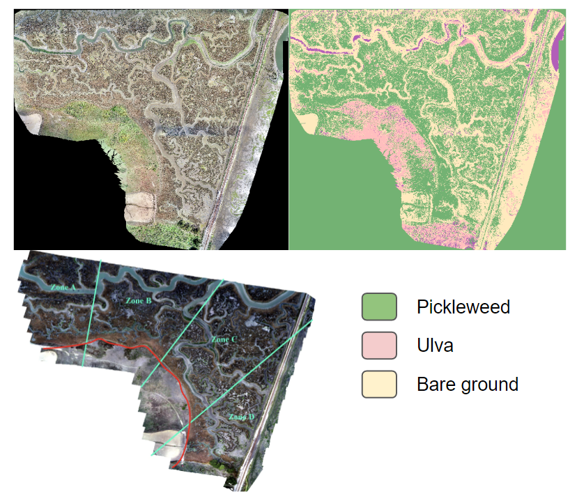

 

{ width=80% }  

As a student specializing in data analysis at CSUMB, our team successfully programmed and deployed a drone for the purpose of collecting RGB data in the Elkhorn Slough habitat restoration area. The objective was to evaluate the variations in salicornia pacifica over a span of five years. The accompanying figure illustrates the original image, the classified raster generated using a supervised learning algorithm, and the designated zones employed to control for geospatial disparities in an ANOVA test.

