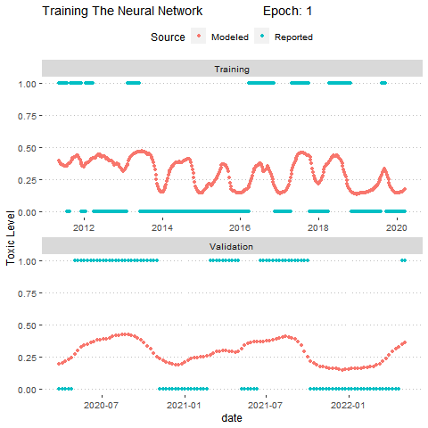

```{=html}
<div class="hero-container">
<div class="hero-title">Jace Innis</div>
<div class="hero-subtitle">Marine Data Science &bull; Geospatial Analytics &bull; Machine Learning</div>
<p style="max-width: 650px; margin: 0 auto; color: #e2e8f0; font-size: 1.05rem;">
Applying computational tools, remote sensing, and predictive modeling to solve complex marine ecological and environmental challenges.
</p>
<div class="hero-badges">
<span class="badge">Machine Learning</span>
<span class="badge">Google Earth Engine</span>
<span class="badge">R &amp; Python</span>
<span class="badge">Geospatial Analysis</span>
<span class="badge">Time Series</span>
<span class="badge">Oceanography</span>
</div>
</div>

<div class="section-header">
<h2>Featured Projects</h2>
<p>Core research initiatives in predictive modeling and ecological species distribution.</p>
</div>

<div class="projects-grid">

<article class="project-card">
<div class="project-card-image-wrap">

</div>
<div class="project-card-body">
<span class="project-tag">Deep Learning &bull; Time Series</span>
<h3 class="project-card-title">Harmful Algal Bloom Early Warning System</h3>
<p class="project-card-text">
An LSTM sequential neural network pipeline predicting shellfish toxicity and red tide outbreaks in the Philippines using multi-decade monitoring bulletins paired with Google Earth Engine oceanographic data.
</p>
<div>
<a href="DavosSixWeekPrediction.html" class="btn-primary">View Project Details &rarr;</a>
</div>
</div>
</article>

<article class="project-card">
<div class="project-card-image-wrap">

</div>
<div class="project-card-body">
<span class="project-tag">Machine Learning &bull; Maxent</span>
<h3 class="project-card-title">White Shark Habitat Suitability Modeling</h3>
<p class="project-card-text">
Maximum Entropy (Maxent) species distribution modeling using Tagging of Pacific Predators (TOPP) telemetry and depth-stratified ocean temperature data to identify key environmental drivers of shark distribution.
</p>
<div>
<a href="shark.html" class="btn-primary">View Project Details &rarr;</a>
</div>
</div>
</article>

</div>

<div style="background: #ffffff; border: 1px solid var(--border-color); border-radius: var(--radius-lg); padding: 2rem; margin: 2rem 0; box-shadow: var(--shadow-sm); display: flex; flex-wrap: wrap; align-items: center; justify-content: space-between; gap: 1.5rem;">
<div>
<h3 style="margin: 0 0 0.4rem 0; color: var(--primary-dark); font-size: 1.3rem;">Explore Data Visualizations</h3>
<p style="margin: 0; color: var(--text-muted); font-size: 0.95rem;">
View animated ocean current trajectories, Google Earth Engine environmental rasters, and spatial maps.
</p>
</div>
<div>
<a href="visualizations.html" class="btn-secondary">Open Visualization Gallery &rarr;</a>
</div>
</div>
```


