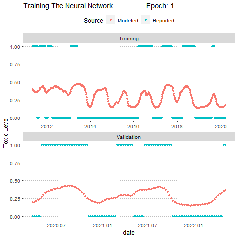

  
  

[{ width=49% }](OceanMovment.html) [{ width=40% }](https://github.com/JaceInnis/RGEEtools)

    Ocean Movement Visualization
    
        Google earth engine for R
    

[{ width=40% }](shark.html) [{ width=42% }](GEEvis.html)

    Shark movement
    
        Java code in GEE to visualise data
    

[{ width=40% }](Santa.html) [{ width=40% }](DavosSixWeekPrediction.html) 

    Santa Lucia preserve topographical map
    
        HAB Early Warning System
    

