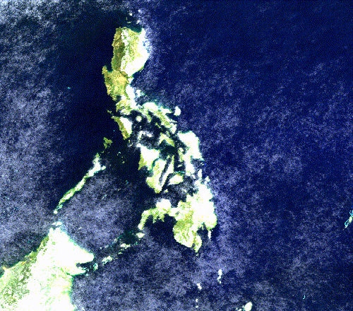
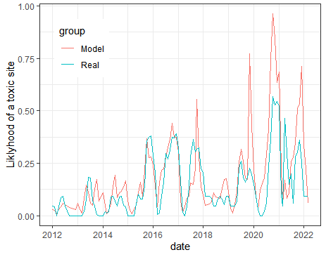

## Shellfish toxicity prediction model

{ width=40% } { width=40% }
{ width=40% } { width=40% }

Over the course of a year, I used various methods in order to see what environmental variables are important in the prediction of shellfish toxicity in the Philippines. I digitized over a decade of HAB reports [HAB reports](http://bfar-frmdhabmonitoring.com.ph/shellfishBulletins/102) from BFAR, a [government agency in the philippines](https://www.bfar.da.gov.ph/). Using this data, which reports the presence of toxic sites, I utilized Java to access data from Google Earth Engine [(GEE)](https://earthengine.google.com/), a geospatial data management system.

### Independent research project

{ width=60% }  

For my independent research, I used a novel AI algorithm to predict site toxicity. I trained and tested an artificial neural network using [TensorFlow](https://www.tensorflow.org/) and [Keras](https://keras.io/), two packages made for deep learning. I am continuing my research with support from the Tandy Center for Ocean Forecasting at Bigelow Marine Labs but my initial results are promising. 

### Logistic regression verification

 $$\LARGE \pi = \frac{e^{\beta _{year}+\beta _{month}+\beta_{sal}+\beta_{vel}+\beta_{temp}+\beta_{temp+vel}}}{1+e^{\beta _{year}+\beta _{month}+\beta_{sal}+\beta_{vel}+\beta_{temp}+\beta_{temp+vel}}}$$ 

###### $\pi$ = the probability of there being a toxic site, $\beta_x$ = envormental variables/time of observation

In order to verify my results from the neural network, I conducted a more transparent statistical analysis. A logistic regression was the most appropriate model to test probability. Every environmental variable’s ability to predict site toxicity was tested, accounting for time of the year. The equation above was the final model and used water velocity, salinity, and temperature .

## Drone Image Classification

{ width=80% }  

As a student of CSUMB’s done specialist, we programmed and deployed a drone to collect RGB data in the Elkhorn Slough habitat restoration area. This was in order to assess the changes of *salicornia pacifica* over a period of five years. The figure above shows the original image, the classified raster made through a supervised learning algorithm, and the zones used to control for geospatial differences in an ANOVA test. 

## Shark tracking

{ width=60% }  

For a class project, my group decided to use [Tagging of Pacific Predators](http://www.coml.org/projects/tagging-pacific-predators-topp.html) data of all white sharks tegged over the past 10 years. This data contained over a hundred thousand of time and location observations spread out between over a hundred individual CSVs. I was in charge of cleaning this data so that statistical analysis could be conducted and also made the animation above to help visualize our data. 

## Rain effect on deadzone

{ width=70% }  

In this project, I used NASA’s rainfall dataset in conjunction with a mask created by USGA’s drainage basin shape file in order to assess the correlation between the Louisiana dead zone size and yearly precipitation. The results of the linear model suggest that there is no correlation between rainfall and dead zone size. This means that the nutrient runoff caused by agriculture into the Mississippi drainage basin is likely the result of irrigation and not rain.  

## Sand dollar sizing project

{ width=70% }  

For my final scientific dive project, in a group of two, we tested the observation that sand dollars tend to be larger the further from the shore. This is known to be true in Oregon and Washington, and after our 6 dive data collection and analysis, we found it to be true in the Monterey Bay. 

## Oil spill's effects on kelp

{ width=48% }    { width=48% }  

###### Red line represents the time of the American Trader oil spill.

Given kelp biomass extrapolated from canopy coverage obtained from landsat images, I conducted an exploratory data analysis to look for an effect caused by the 1990 American Trader oil spill. I found a significant reduction in the average kelp biomass around the oil spill, and quantified the recovery rate. 

