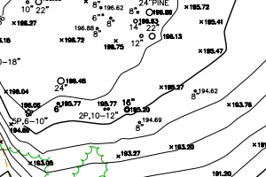
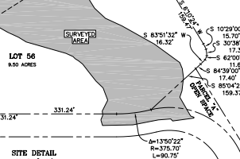

 

{ width=100% height=800px}  

This map was made using AutoCAD with data that I collected using a total station in the field. The entire survey took one day and includes the property boundary, all trees greater than 6 inches in diameter, the drip line of the tree canopy, elevation, roads, utilities and thicker foliage. The elevation was referenced to a single point utilizing the NAV datum of 1988.

The drafting took about a day as well and was one of my later projects so I felt a lot more confident in my drafting and was able to complete it a lot faster than previous maps.

This map is intended to be used by an architect to design a building to be placed on the property so accuracy is very important.

This property is located in an area called Rancho El Potrero in the Carmel Highlands and is in a remote location about 45 minutes from Monterey.

{ width=30% }  { width=30% }  

