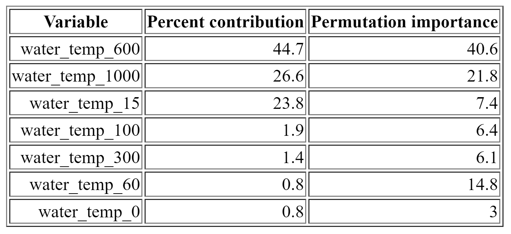
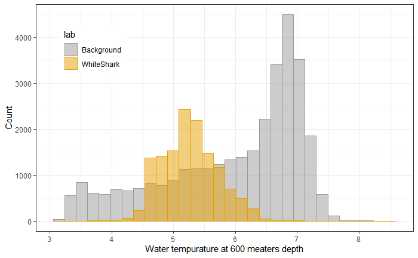

{ width=60% }  

I used [Tagging of Pacific Predators](http://www.coml.org/projects/tagging-pacific-predators-topp.html) data of all white sharks tagged over the past 10 years. This data contained over a hundred thousand of time and location observations spread out between over a hundred individual CSVs. Icleaned  this data so that statistical analysis could be conducted 

{ width=49% }  { width=49% }

A machine learning Maxent model was also programmed to look for any significant depths at which we can see the white sharks in relation to temperature. We found that at a depth of 600 meters, the greatest difference in the distribution between the observed values and background values. 

MaxEnt leverages the concept of maximum entropy to estimate. By pinpointing these important variables, researchers can gain valuable insights into shark behavior, habitat preferences, and potential conservation measures, ultimately contributing to effective management strategies and the protection of shark populations.

 