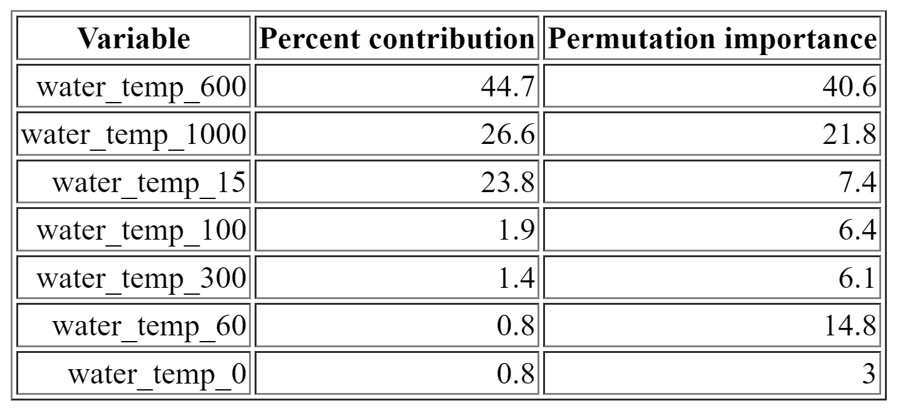
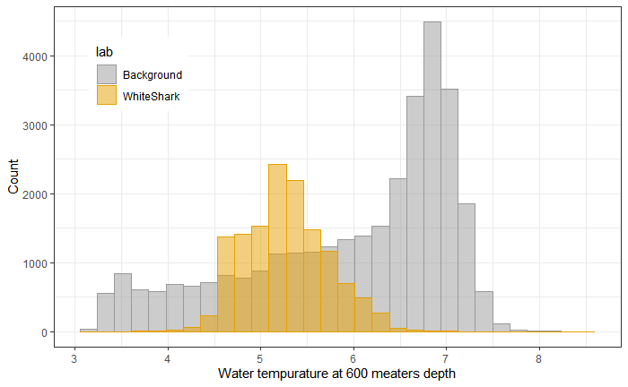

{ width=60% }  

For a class project, my group decided to use [Tagging of Pacific Predators](http://www.coml.org/projects/tagging-pacific-predators-topp.html) data of all white sharks tagged over the past 10 years. This data contained over a hundred thousand of time and location observations spread out between over a hundred individual CSVs. I was in charge of cleaning this data so that statistical analysis could be conducted and also made the animation above to help visualize our data. 

{ width=49% }  { width=49% }

A machine learning Maxent model was also programmed to look for any significant depths at which we can see the white sharks in relation to temperature. We found that at a depth of 600 meters, the greatest difference in the distribution between the observed values and background values. 

