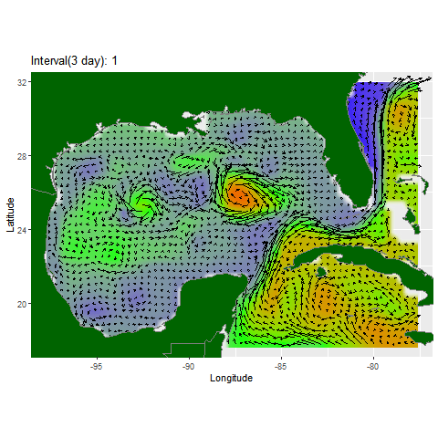

This gallery collects visual work from projects involving oceanographic data, animal movement, and remote sensing.

```{=html}
<div class="visualization-gallery">

<article class="visualization-card">
  
  <h2>Ocean Movement &amp; Hydrodynamics</h2>
  <p>Animated HYCOM water-velocity and surface elevation data visualizing ocean currents across space and time.</p>
</article>

<article class="visualization-card">
  
  <h2>Shark Movement &amp; Telemetry</h2>
  <p>Spatial tracking visualization presenting tagged white shark migration and behavior patterns across the Pacific.</p>
</article>

<article class="visualization-card">
  
  <h2>Oceanographic Variables in GEE</h2>
  <p>Google Earth Engine animations and raster analyses comparing salinity, temperature, and sea surface height.</p>
</article>

</div>
```